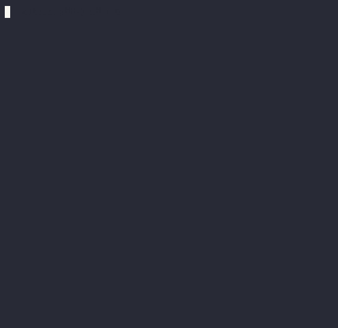

<div align="center">


# sandstorm

**Cairo prover powered by [miniSTARK](https://github.com/andrewmilson/ministark/)**

[](https://github.com/andrewmilson/sandstorm/blob/main/LICENSE)
[](https://github.com/mkenney/software-guides/blob/master/STABILITY-BADGES.md#experimental)

</div>

Sandstorm is a Cairo prover built on top of miniSTARK. The prover was built by reverse engineering [StarkWare's open source verifier](https://github.com/starkware-libs/starkex-contracts) and was used to submit the first independent proof to StarkWare's Ethereum verifier (see tweet [here](https://twitter.com/andrewmilson/status/1686292241990692864)).

## Demo - proving Cairo programs

|  |  |
|:--:|:--:|
| *Generating the proof* | *Verifying the proof* 

In this demo, the prover has a Cairo program that appears to sum the values of an array. The prover runs the program with `cairo-run` to generate `trace.bin` (stores register values at each VM cycle) and `memory.bin` (stores memory address value pairs). The prover then runs `sandstorm prove` which builds a STARK execution trace and proof from `trace.bin`, `memory.bin` and the compiled program.


The verifier, supplied with this proof and the original code, can run `sandstorm verify` to assert the program was executed correctly without having to run the program themselves. This is a small program for demonstration purposes and it'd probably be faster for the verifier to run the program themselves. Sandstorm is capable of generating proofs for much larger programs, where proof verification would run orders of magnitude faster than running the program. To run this demo locally:

```bash
# 1. (optional) install Cairo and activate the venv
# https://www.cairo-lang.org/docs/quickstart.html
source ~/cairo_venv/bin/activate

# 2. (optional) compile and run the Cairo program
cairo-compile example/array-sum.cairo --proof_mode --output example/array-sum.json
cairo-run --program example/array-sum.json \
          --air_private_input example/air-private-input.json \
          --air_public_input example/air-public-input.json \
          --trace_file example/trace.bin \
          --memory_file example/memory.bin \
          --min_steps 128 \
          --layout recursive \
          --proof_mode

# 3. generate the proof
cargo +nightly run -p sandstorm-cli -r -F parallel,asm -- \
    --program example/array-sum.json \
    --air-public-input example/air-public-input.json \
    prove --air-private-input example/air-private-input.json \
          --output example/array-sum.proof

# 4. verify the proof
cargo +nightly run -p sandstorm-cli -r -F parallel,asm -- \
    --program example/array-sum.json \
    --air-public-input example/air-public-input.json \
    verify --proof example/array-sum.proof
```

<details>
<summary>Proving Cairo programs with Goldilocks field</summary>

## Work in Progress - ~~Proving Cairo programs with Goldilocks field~~

~~The goldilocks field is a magical 64-bit prime field that has very fast arithmetic. This field was discovered after StarkWare built their Solidity verifier for Cairo programs. As a result Cairo uses a much larger 252-bit prime field by default. Arithmetic in this 252-bit field is slow and it can be hard to practically utilize the storage provided by each field element.~~

~~Sandstorm recently supported proving Cairo programs with the 64-bit Goldilocks field instead of StarkWare's default 252-bit field. On a M1 Max proof generation is 5x faster using the 64-bit Goldilocks field and only uses 1/4 of the overall memory when compared against Cairo's default 252-bit field. To run and prove with Goldilocks field locally:~~

```bash
# 1. install Cairo and activate the venv
# https://www.cairo-lang.org/docs/quickstart.html
source ~/cairo_venv/bin/

# 2. compile the Cairo program with Goldilocks field
cairo-compile example/array-sum.cairo \
        --prime 18446744069414584321 \
        --output example/array-sum.json \
        --proof_mode

# 3. modify the Cairo runner to support Goldilocks
# there are a few overly protective asserts that need to be commented out to get 
# things working. The location of these files is based on where you installed Cairo.
# For me they were in `~/cairo_venv/lib/python3.9/site-packages/starkware/cairo/`.
# Remove or comment out the following asserts:
# - lang/vm/relocatable.py line 84 `assert value < 2 ** (8 * n_bytes - 1)`
# - lang/compiler/encode.py line 38 `assert prime > 2 ** (3 * OFFSET_BITS + 16)`

# 4. run the Cairo program
cairo-run --program example/array-sum.json \
        --trace_file example/trace.bin \
        --memory_file example/memory.bin \
        --min_steps 128 \
        --proof_mode

# 5. generate the proof
cargo +nightly run -r -F parallel,asm -- \
    --program example/array-sum.json \
    prove --trace example/trace.bin \
        --memory example/memory.bin \
        --output example/array-sum.proof

# 6. verify the proof
cargo +nightly run -r -F parallel,asm -- \
    --program example/array-sum.json \
    verify --proof example/array-sum.proof
```
</details>

<details>
<summary>How Sandstorm works</summary>

## How Sandstorm works

Those curious about the inner workings of Sandstorm can read the comments in [air.rs](layouts/src/starknet/air.rs#115). The comments expect some understanding of how STARK proofs are generated - if you need some background on this then [Anatomy of a STARK (part 4)](https://aszepieniec.github.io/stark-anatomy/) by [Alan Szepieniec](https://twitter.com/aszepieniec) is a great resource. The pseudo code in section 4.5 of the [Cairo whitepaper](https://eprint.iacr.org/2021/1063.pdf) provides a nice high level overview of how some pieces fit together.
</details>